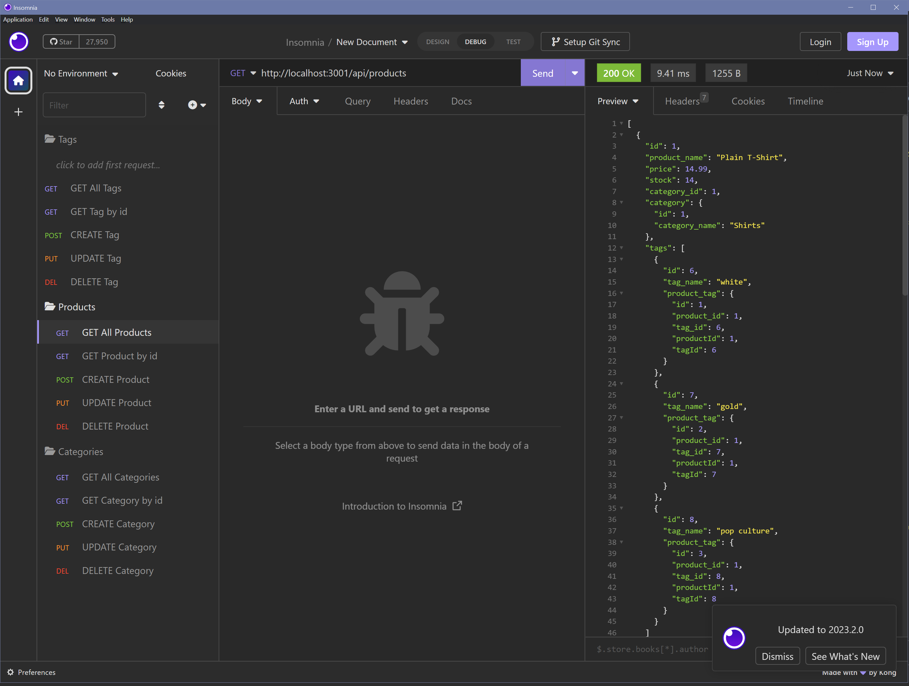

# 13 Object-Relational Mapping (ORM): E-Commerce Back End
  

## Description
AS A manager at an internet retail company
If you want a back end for your e-commerce website that uses the latest technologies
SO THAT your company can compete with other e-commerce companies
THIS is the app for you!

## Table of Contents:
- [Description](#description)
- [Installation](#installation)
- [Usage](#usage)
- [License](#license)
- [How to Contribute](#how-to-contribute)
- [Tests](#tests)

## Installation
Items required: node.js - npm install, MySQL database, Insomnia

## Usage
```md
A functional Express.js API
WHEN you add your database name, MySQL username, and MySQL password to an environment variable file
THEN you are able to connect to a database using Sequelize
WHEN you enter schema and seed commands
THEN a development database is created and is seeded with test data
WHEN you enter the command to invoke the application
THEN your server is started and the Sequelize models are synced to the MySQL database
WHEN you open API GET routes in Insomnia for categories, products, or tags
THEN the data for each of these routes is displayed in a formatted JSON
WHEN you test API POST, PUT, and DELETE routes in Insomnia
THEN you are able to successfully create, update, and delete data in my database
```



[Video Walktrough](https://drive.google.com/file/d/1FQL0Wc92H171mELsUQ3m5_8DPKCIedjR/view)

## License
MIT License

https://spdx.org/licenses/MIT.html

## How to Contribute
PayPal me to my email :)

## Tests
n/a

## Questions
If you have any questions, you can reach me at:

Email: p.orest@gmail.com

or

GitHub: https://github.com/00rest

